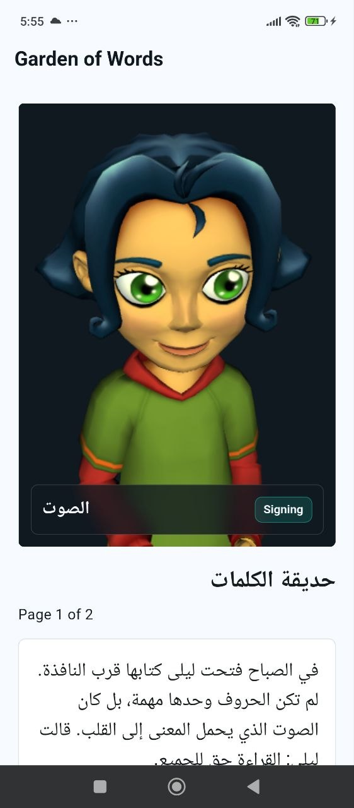

# 📚 BookForEveryone / KitabLilJamie

<div align="center">
  
</div>

**Accessible reading MVP for everyone: blind, visually impaired, and deaf readers.**

The first slice of this platform is an offline-first Flutter mobile application tailored to provide specialized tools for different accessibility needs. Whether it's reading along with a 3D sign language avatar or using text-to-speech with haptic controls, BookForEveryone ensures stories are accessible.

## ✨ Key Features

- **🧠 SignBook (Deaf Friendly)**: Visual reading experience featuring a 3D signing avatar (powered by CWASA WebGL), highlighting gloss chips, haptic feedback hooks, and Arabic gloss matching support.
- **🗣️ Samia (Blind / Visually Impaired Friendly)**: Voice-first reading powered by `flutter_tts`, featuring text command fallbacks, easy page controls, and automatic progress saving.
- **🚀 Dual Mode**: Fully functional offline-first architecture with localized JSON, bundled with an optional **FastAPI backend** for scalable book delivery and gloss API endpoints.

## 📂 Project Structure

```text
mobile/      # Flutter app source code and local assets (Offline first)
backend/     # FastAPI backend for managing books and text-to-gloss translation
docs/        # Demo scripts, pitch materials, and architecture notes
```

---

## 📱 Mobile Quickstart

Flutter and the Android toolchain are configured in this environment. The app uses `assets/data/sample_books.json` for offline demo content.

```bash
cd mobile
flutter pub get
flutter build apk --debug
```

*See [mobile/README.md](mobile/README.md) for the mobile route map and accessibility notes.*

---

## ⚙️ Backend Quickstart

The backend provides endpoints for health checks, book content, and text-to-gloss translation.

```bash
cd backend
make install
make run
```
**API Endpoints:**
- `GET http://127.0.0.1:8000/health`
- `GET http://127.0.0.1:8000/api/books`
- `GET http://127.0.0.1:8000/api/books/arabic-garden/content?page=1`

**Docker Support:**
```bash
docker compose -f backend/docker-compose.yml up --build -d
```

---

## 🚀 Pitch & Demo

Use [docs/pitch.md](docs/pitch.md) and [docs/demo_script.md](docs/demo_script.md) to explore the hackathon presentation flow and demonstration steps.
